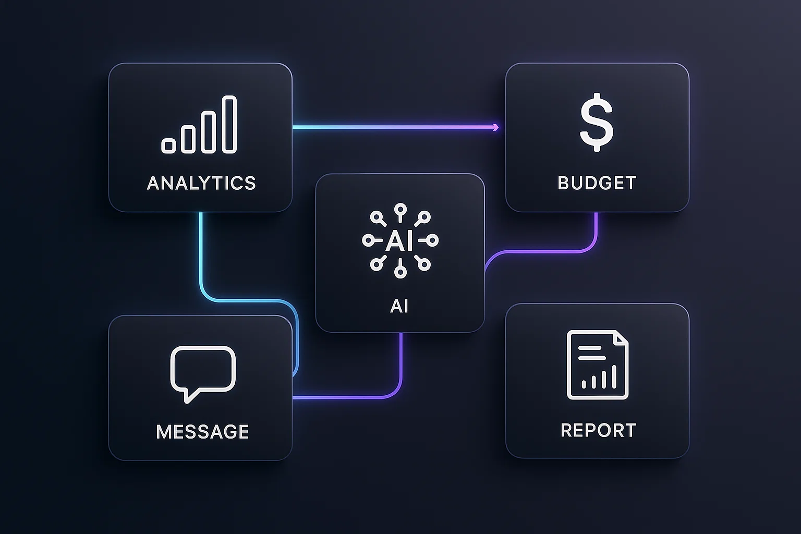

# ⚡️ SaaS Startup Fast Launch Stack

A curated stack to go from **idea → MVP → launch → growth** fast.  
Free tiers first, automation-friendly, AI-ready.

> Collected by Yerdaulet. PRs welcome!

## 🧠 Idea & Validation
- **Fillout** — custdev surveys
- **Notion** — docs, backlog
- Google Forms / Typeform

## 🎨 Build (Frontend)
- **Cursor** — AI editor for fast UI
- **Next.js** — fullstack React
- **Vercel / Netlify** — instant hosting

## 🔐 Auth
- **Clerk** (free tier)
- Supabase Auth
- Auth0

## ⚙️ Backend & DB
- **Supabase** — Postgres + auth + storage
- Firebase
- Railway / Render
- Docker

## 🤖 Automation & AI
- **n8n** — open-source automation
- **Latenode** — low-code AI workflows (300 free executions)
- **Make.com** — rich connectors (Zapier alt)
- LangChain / Vercel AI SDK

## 📊 Analytics
- GA4, Google Tag Manager
- **PostHog** — product analytics

## 💬 Support & Comms
- **Intercom** — chat, onboarding
- Tally / Fillout — feedback forms
- Beehiiv / Substack — newsletters

## 💳 Payments & Billing
- **Stripe**
- LemonSqueezy
- Paddle

## 🚀 Launch & Growth
- **Product Hunt** — launch & PR
- Reddit communities
- Indie Hackers
- LinkedIn / X

---

## How to use this stack
1. **Validate** with Fillout surveys → synthesize in Notion  
2. **Prototype** in Cursor + Next.js → host on Vercel  
3. **Wire automations** via n8n / Latenode / Make  
4. **Measure** with GA4 + PostHog  
5. **Monetize** via Stripe or LemonSqueezy  
6. **Support** users in Intercom  
7. **Launch** on Product Hunt + Reddit  
8. **Grow** with content + cohorts, iterate weekly

---

## Contribute
Got a tool or guide that saves time/money?  
Open a **Tool Suggestion** issue or PR that updates `data/tools.json`.

**Topics:** `saas` `startup` `stack` `automation` `ai` `product-hunt` `intercom` `supabase` `n8n` `latenode` `make` `clerk` `stripe` `posthog`